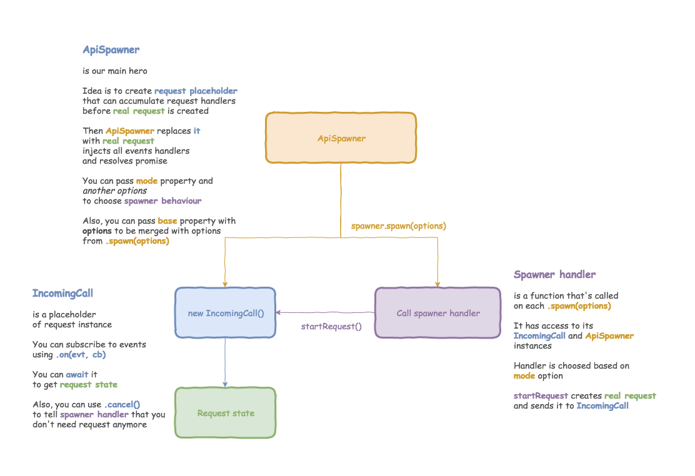

# Spawner API

## What is Spawner?

Spawner is a smart tool that defines your requests flow.

It allows you to easily make **debounced** requests or call requests **in queue**

## How spawner works

Just look at this diagram



## Create a spawner

```javascript
import fetch from "@apicase/adapter-fetch"
import { ApiSpawner } from "@apicase/spawner"

/* Create a spawner */
const spawner = new ApiSpawner({
  mode: "queue",
  base: {
    adapter: fetch
  }
})

/* Spawn requests */
spawner.spawn({ url: "/foo" })
spawner.spawn({ url: "/bar" })
spawner.spawn({ url: "/baz" })
```

## Spawner modes

### default - just create requests on each .spawn\(\)

```javascript
const spawner = new ApiSpawner({
  mode: "default",
  base: {
    /* ... */
  }
})

/* Will call all requests */
spawner.spawn({ url: "/foo" })
spawner.spawn({ url: "/bar" })
spawner.spawn({ url: "/baz" })
```

### queue - call next request after previous ends

```javascript
const spawner = new ApiSpawner({
  mode: "queue",
  time: 500,
  base: {
    /* ... */
  }
})

/* Will call `/bar` after `/foo` finish + 500ms delay */
spawner.spawn({ url: "/foo" })
spawner.spawn({ url: "/bar" })
```

### delay - call request with delay

```javascript
const spawner = new ApiSpawner({
  mode: "delay",
  time: 500,
  base: {
    /* ... */
  }
})

/* Will call all requests after 500ms */
spawner.spawn({ url: "/foo" })
spawner.spawn({ url: "/bar" })
spawner.spawn({ url: "/baz" })

/* req.cancel() before timeout will drop timer */
const req = spawner.spawn({ url: "/skip" })
req.cancel()
```

### interval - call requests with repeats

```javascript
const spawner = new ApiSpawner({
  mode: "interval",
  time: 500,
  base: {
    /* ... */
  }
})

/* Will start request again after finish + 500ms delay */
const req = spawner.spawn({ url: "/foo" })

/* req.cancel() will stop interval */
req.cancel()
```

### debounce - cancel request and start again to prevent spam

```javascript
const spawner = new ApiSpawner({
  mode: "debounce",
  time: 200,
  base: {
    /* ... */
  }
})

/* 
  If another request isn't running - start request after 200ms
  Otherwise, cancel the current one and start timer again
*/
spawner.spawn({ url: "/search", query: { q: "f" } })
spawner.spawn({ url: "/search", query: { q: "fo" } })
spawner.spawn({ url: "/search", query: { q: "foo" } })
spawner.spawn({ url: "/search", query: { q: "foo " } })
spawner.spawn({ url: "/search", query: { q: "foo b" } })
spawner.spawn({ url: "/search", query: { q: "foo ba" } })
spawner.spawn({ url: "/search", query: { q: "foo bar" } })
```

### throttle - skip requests if you spawn too fast

```javascript
const spawner = new ApiSpawner({
  mode: "throttle",
  time: 200,
  base: {
    /* ... */
  }
})

/* 
  Just like spawner has cooldown 
  Won't spawn next till time's up 
*/
spawner.spawn({ url: "/ping" })
spawner.spawn({ url: "/ping" })
spawner.spawn({ url: "/ping" })
spawner.spawn({ url: "/ping" })
spawner.spawn({ url: "/ping" })
```

## More

### Use ApiService as a base

You can use ApiService as spawner `base` as well

```javascript
const base = new ApiService({
  adapter: fetch,
  url: "/api"
})

const spawner = new ApiSpawner({
  mode: "queue",
  base
})

spawner.spawn({ url: "foo/bar" })
```

### Define custom spawner mode

```javascript
const customMode = ({
  state, // Contains `isBlocked` flag and `queue`
  options, // Contains `base`, `delay` and `mode`
  spawner, // ApiSpawner instance. You can do spawner.spawn()
  reqOptions, // Request options from spawner.spawn(options) merged with base options
  placeholder, // IncomingCall instance. Use placeholder.on(evt, cb) for your need
  createRequest // Callback that starts request
}) => {
  /* ... */
}

const spawner = new ApiSpawner({
  mode: customMode
})
```


