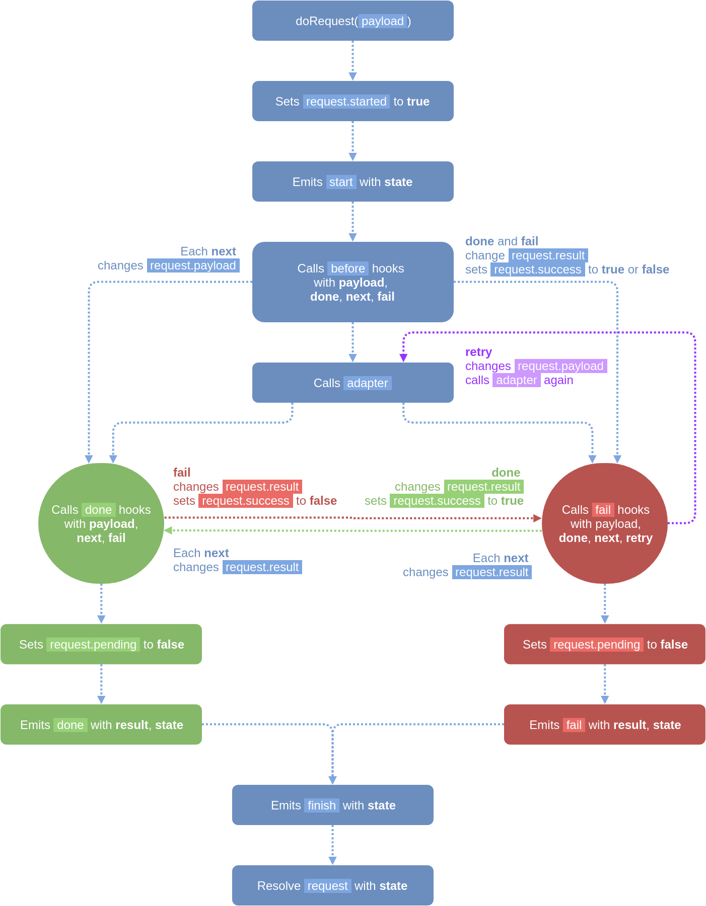

# Requests

Core function of Apicase is `apicase` (ba-dum-tss). It uses adapters, creates requests and does some good things.

## Wrap adapters

Firstly, you need some adapter (e.g. `fetch`). Pass it to `apicase` and you'll get a function that works with this adapter:

```javascript
import { apicase } from "@apicase/core"
import fetch from "@apicase/adapter-fetch"

const doFetchRequest = apicase(fetch)
```

## Request structure

The received function takes an object with the following format:

```javascript
doFetchRequest({
  /* Just payload */
  ...payload,
  /* Hooks object */
  hooks: {
    /* You can pass a single hook */
    before: () => {},
    /* Or array of hooks */
    done: [() => {}, () => {}],
    fail: () => {}
  },
  /* Meta info that is passed only to hooks */
  meta: { foo: "bar" },
  /* Specific request options (we'll talk about it later) */
  options: {}
})
```

Simplest example:

```javascript
const request = doFetchRequest({
  url: "/api/posts",
  method: "GET"
})
```

## Response structure

This function returns an object with **state**, **on/off** and **start/cancel **and **then/catch** methods

### State

It's just some flags, payload and result

```javascript
request.success // If request is finished successful
request.pending // If request is running
request.started // If request was started
request.cancelled // If request was cancelled
request.payload // Request payload (here: { url, method })
request.result // Result from adapter (can have initial state, if adapter has)
```

### Events

You can subscribe to events using `.on()` method and unsubscribe from 'em using `.off()`

```javascript
request.on("done", (result, state) => {}) // On request success
request.on("fail", (result, state) => {}) // On request fail
request.on("finish", (result, state) => {}) // On request finish (success doesn't matter)
request.on("start", state => {}) // On request start
request.on("cancel", state => {}) // On request cancel
request.on("error", error => {}) // On JavaScript error happened

request.off("evt", callback) // Unsubscribe from event

// Syntax sugar
request.onDone(cb) === request.on("done", cb)
request.onFail(cb) === request.on("fail", cb)
```

You can add as much events as you want

### Start and cancel

You can `.start()` and `.cancel()` requests:

```javascript
request.start() // Start request (see "Requests+" when we need to start manually)
request.cancel() // Cancel request
```

### Then and catch methods

Apicase also gives you `.then()` and `.catch()` methods to feel like it's just a Promise:

```javascript
doFetchRequest({ url: "/posts" })
  /* Always resolved (even when request has failed */
  .then(state => {
    console.log(state)
  })
  /* Rejected only when JS error happened */
  .catch(err => {
    console.error(err)
  })
```

Since it returns thenable object, you can also use `async/await`

```javascript
const { success, result } = await doFetchRequest({ url: '/posts' })
```

## Request flow

Apicase creates a queue of hooks and adapter call. Let's see this diagram



Hooks are used for request-level logic. All hooks are asynchronous and have callbacks to continue the queue. It allows you to do another requests, check something, just sleep and do whatever you want in hooks.

Events are used for application-level logic.You cannot change request state from them. They are just made to listen to it. Also some adapters may emit custom events (like `progress` in `xhr` adapter)

## Detecting state changes

Apicase has 3 additional events that are emitted on state changes.

All of them have the following structure:

```javascript
request.on("change:state", ({ prev, next, diff }) => {
  console.log(prev) // Previous state
  console.log(next) // New state
  console.log(diff) // Object with changed properties
})
```

* **change:state** - on state changes (`success`, `pending`, `started`, `cancelled`, `payload`, `result`)
* **change:payload** - on payload only changes (`payload.url`, `payload.headers` etc)
* **change:result** - on result only changes (`result.body` etc)

You can use it to create services and connect them with your store (e.g. Vuex)
